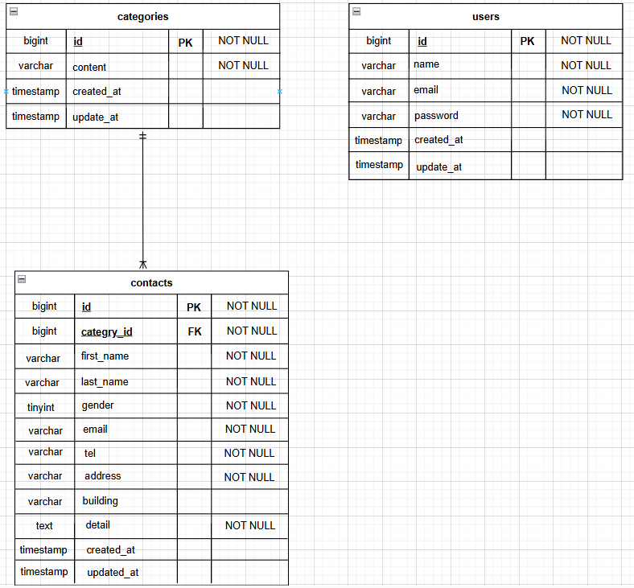

# アプリケーション名
Inquiry-Form


## 環境構築

### 1. リポジトリをクローン

```
git clone git@github.com:ayano-0819/inquiry-form.git
```
### 2. プロジェクトに移動

```
cd inquiry-form
```
### 3. Dockerコンテナをビルド

```
docker compose up -d --build
```
### 4. Laravelのパッケージのインストール

```
docker compose exec php bash

composer install
```

### 5. .envファイル作成（PHPコンテナ内で入力）

```
cp .env.example .env
```

### 6. アプリケーションキーの生成（PHPコンテナ内で入力）

```
php artisan key:generate
```

### 7. .envファイル修正
4で作成された「.env 」を以下のように修正してください。

```
DB_CONNECTION=mysql
DB_HOST=mysql
DB_PORT=3306
DB_DATABASE=laravel_db
DB_USERNAME=laravel_user
DB_PASSWORD=laravel_pass
```
### 8. マイグレーション実行（PHPコンテナ内で入力）

```
php artisan migrate
```

### 9. シーディングの実行（PHPコンテナ内で入力）

```
php artisan db:seed
```


## 使用技術（実行環境）
- PHP 8.1.34
- Laravel 8.7
- MySQL 8.0
- Nginx 1.21
- Docker 28.4.0


## URL

・お問い合わせフォーム
```
http://localhost
```

・ユーザー登録
```
http://localhost/register
```

・phpMyAdmin
```
http://localhost:8080
```


## ER図
